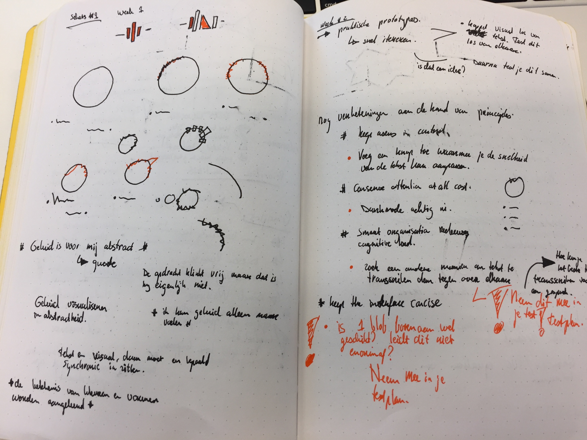
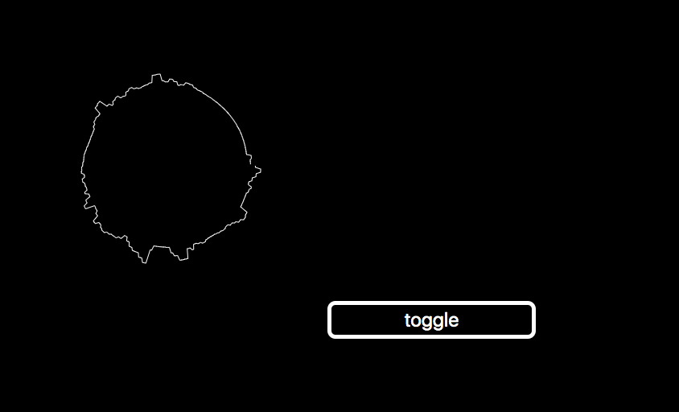
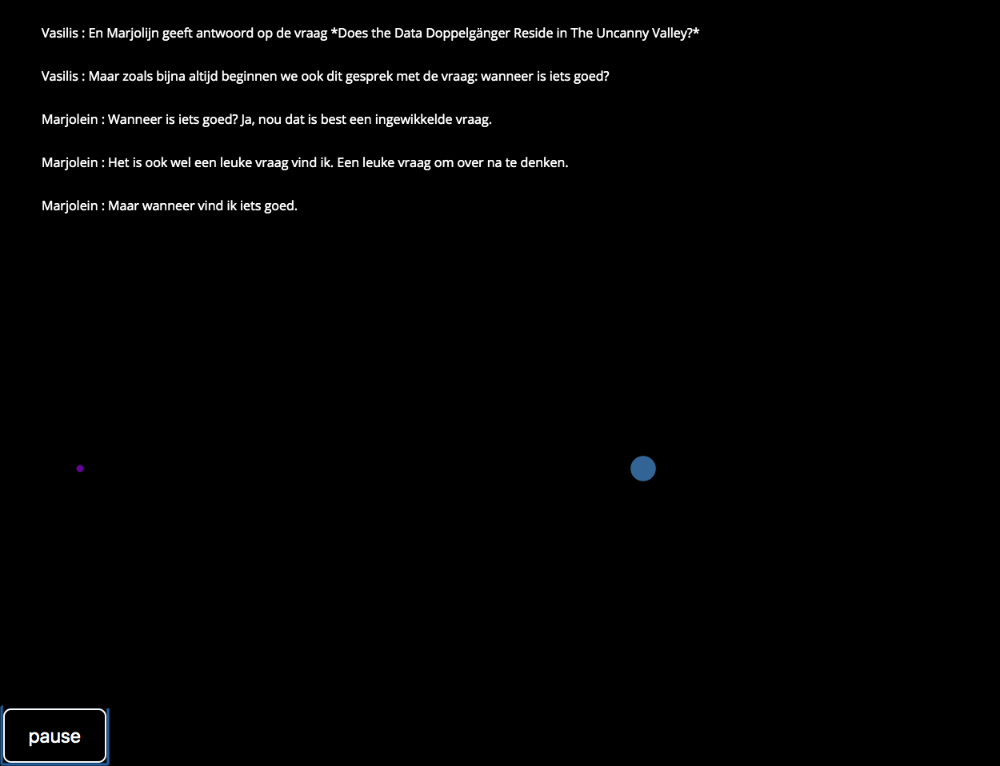

# Web-design

Het doel van deze opdracht is om kennis te maken met je gebruiker met behulp van usertests en de kunst van het itereren. In mijn opdracht zou ik een podcast ontwerpen voor Marie van Driesche. 
Marie is een doof persoon dus zal alleen een audio podcast voor haar niet zo interessant zijn. Aan ons als designers de taak om een podcast te ontwerpen waar zij wel de inhoud van zal verstaan. 

## Inhoudsopgave
- [opdracht](#opdracht)
- [week 1](#week1)
    - [insights uit week 1](#insights-uit-week-1)
    - [Quotes van Marie](#Quotes-van-Marie)
- [week 2](#week2)
    - [Usertest](#usertest)
    - [Bevindingen van de user test](#Bevindingen-van-de-user-test)
    - [Wat ging goed](#wat-ging-goed)
    - [Reflectie](#reflectie)
    - [Insights](#insights)
        - [unkown unknowns](#unknown-unknowns)
    - [Aanpassingen User Story](#aanpassingen-user-story)
    - [User Story week 2](#user-story-week-2)
- [week 3](#week3)
    - [Usertest](#usertest)
    - [Bevindingen van de user test](#bevindingen-van-de-user-test)
    - [Wat ging goed](#wat-ging-goed)
    - Wat doe ik de volgende usertest beter
    - insights usertest
        - De unknown unknowns
    - Aanpassingen User Story week 3
    - User Story week 3
- Uiteindelijk product
- [reflectie](#Reflectie)

### Opdracht

Ontwerp een podcast voor Marie. 

### week 1

In de eerste week ben ik vooral verkennend aan de slag gegaan. Om deze verkennende fase wat meer te geleiden heb ik voor mezelf de volgende vragen opgesteld: 

- Waar worden podcasts op geluisterd? Met welk apparaat en via welk medium? 
- Met welke alternatieve manieren ben is Marie al bekend? En wat zijn de valkuilen hier van. 
- Is er een standaard? Zoja, wat is deze
- Wat zijn de verschillen qua grammatica en kan ik hier wat mee doen
- Is het verschil in grammatica daadwerkelijk een probleem? Of vangen de betekenis wel in de context op. 
- Vindt Marie het fijner om het ‘gewoon’ nederlands te lezen?

Uiteindelijk heb met behulp van deze vragen, veel informatie verzameld om het probleem in zijn eerste vorm goed te kunnen begrijpen. 

#### Usertest 

Wat ik deze week vooral te weten wil komen zijn antwoorden op de vragen die ik voor mezelf heb opgesteld hierboven. De insights geven antwoord op deze vragen. De vragen heb ik niet allemaal zelf gesteld, door het meeluisteren bij andere userTest heb ik ook een groot deel van de kennis opgevangen.  

#### insights uit week 1

- Marie heeft moeite met grote lappen tekst te lezen. Zeker als dit in een snel tempo voorbij komt razen op het scherm. Grote stukken tekst op deze manier zijn vermoeiend om te lezen. Een manier voor haar om dit te handelen is wanneer zij zelf het tempo kan bepalen.
- Emoties of nuance uitdrukken in taal is nogal absctract voor Marie. Wanneer horenden een woord in hoofdletters zien staan weten zij dat het woord uitgeschreeuwd wordt.
  Voor Marie geldt dit effect niet. Zij kan geen relatie leggen tussen de nuance van de taal en hoe de taal is vormgegeven.
- International sign is geen taal met 1 betekenis/grammatica base.
- Een podcast, in welke vorm dan ook, blijft een dialoog. Dat dialoog zal zij niet meekrijgen wanneer je alleen maar tekst ziet. Dus hoe benadruk je het dialoog wanneer iemand niet kan horen.
- Emoties worden in de doven gemeenschap uitgedrukt in gebarentaal en er kan veel worden afgelezen aan gezichtsuitdrukking.
- Voor horende is humor een breder concept dan voor een dove. Humor hangt veel af van timing en tone of voice. Dit zijn aspecten die zij niet meekrijgt.
- Marie gaat op vakantie en gaat mee op excursies. Dit is mogelijk doordat er een tolk bij is. Of de begeleider van de excursie/rondleiding is zelf een dove tolk.
- de betekenis van kleuren en vormen worden je aangeleerd. Marie heeft bij bepaalde kleuren en/of vormen minder een gevoel dan dat horende dat hebben.
- Er is een standaard voor het transcriben van geluid icm een gesprek/beeld. Maar deze is nog niet ideaal omdat veel belangrijke details over de context van de inhoud nog steeds ontbreken. Zelfs de VPRO heeft hier nog geen accesible variant van gebracht. 
- Bron : site vasilis en transcriptie

#### Quotes van Marie

\- Geluid is voor mij abstract

\- ik kan geluid alleen maar voelen

\- Ik heb geen taal in mijn hoofd

\- wat ik zie kan interpreteren

### week 2

#### Usertest

- Zegt een visualisatie van geluid iets voor Marie? Zij gaf aan dat geluid abstract is voor haar. Wat doet het visualiseren van geluid voor haar?

#### Bevindingen van de user test

#### Wat ging goed

Wat ik tijdens de user test goed vond gaan was mijn vermogen om door te vragen bij bepaalde opmerkingen van Marie. Hierdoor ben ik achter een Unknown unknow gekomen waar ik verder op wil gaan itereren.

#### Wat doe ik de volgende usertest beter

Aangezien ik een product ontwerp alleen voor Marie zou ik meer kunnen doorvragen op haar persoonlijke voorkeuren en haar karakter.

Om een voorbeeld te noemen: Het viel mij op dat zij een tatoege had. De tatoeage had een afbeelding wat ik niet herkende. Als ik erachter zou willen komen wat vorm en kleuren voor haar betekenen, zou ik best kunnen vragen naar haar tatoeage. De volgende keer maak ik meer gebruik van dit soort insights om te kunnen doorvragen bij testpersonen.

#### Insights Usertest

\- Stripboeken  werden als voorbeeld aangehaald door Marie. Stripboeken zijn een goed voorbeeld waarin de nuance en inflictie van een gesprek kan worden benadrukt in beeld en schrift.

\- Lange stukken tekst waar ze zelf doorheen kan scrollen zijn niet alleen vermoeiend om te lezen maar, kan ook de indruk van 'robotisch' vertellen geven.

\- Dat de betekenis van kleuren en vorm subjectief is, is bevestigd naar aanleiding van testen gedaan door andere klasgenoten.

\- naar aanleiding van testen gedaan door klasgenoten is bevestigd dat wanneer er lange stuk tekst worden omgezet naar iets van een signlanguage, het bijna beter is om dit woord voor woord te doen.

\- transcriptie van geluid heeft veel meer invalshoeken dan alleen puur volumne. Zo haalde Marie het voorbeeld aan van de kaas in een netflix serie. De kaasboer in de serie klopt op een stuk kaas om te horen van deze al rijp is of niet. Wanneer de klop hol klinkt is de kaas nog niet rijp genoeg. Hoe omschrijf je een hol geluid aan marie?

\- Kan ik aparte audiosporen laten visualiseren wanneer er een gesprek is tussen twee personen?

##### De unkown unknowns

\- De vorm en uitvoering kan associatie hebben met de activiteit. Dus in dit geval was een ellipse niet vanzelfsprekend genoeg om een gesprek te suggeren aan iemand die het gesprek niet kan horen. Een voorbeeld hiervan is een clip van missy elliot. De muziek kan marie niet horen maar aan de dansers in de clip is wel af te leiden dat het om een muziekstuk gaat die behoorlijk dansbaar is.

\- Dus een ellipse is niet de ideale vorm om een gesprek te benadrukken.

\- Het voorkomen van Marie geeft mij de indruk dat het prototype best een beetje buiten de gebaande wegen mag vallen.

#### Aanpassingen User Story week 2

Aan de hand van de user test pas ik mijn user story aan. De user story van week 2 is dus ook een iteratie op de user story van week 1.

[user story week 1](week1Notes.md)

Er zijn een paar dingen veranderd in de user story:

\- Alle schuingedrukte zinnen zijn er sinds de laatste user test bijgekomen of aangepast.

\- De alinea waarin wordt beschrijven waarom zij graag podcasts luistert heb ik verwijderd. In de eerst user story baseerde ik dit op een aanname. In de usertest vermelde zij dat zij podcasts over allerlei onderwerpen interessant vindt.

\- De alinea waarin wordt beschreven hoe zij toch toegang kan krijgen tot de inhoud van podcasts is wat toegespitster naar mijn ontwerp.

#### User story week 2

Marie van Driessche is een Nederlandse grafische ontwerpster. Ook is ze werkzaam als interactie ontwerper.

Marie is doof en daarom spreekt zij meerdere talen gebarentaal. In nederlandse gebarentaal is zij fluent.

Wel kan zij Nederlands vloeiend lezen. *_**Marie is trots lid van de doven community in Nederland en zij kan evenveel als iemand een horende.**_*

*_**Tevens is Marie zelf behoorlijk creatief en vindt het niet erg als producten een beetje buiten de gebaande wegen gaan**_*.

*_**Podcasts zijn een waardevolle bron van informatie. Van Documentaires tot interessante gesprekken tussen twee authoriteiten in hun vakgebied**_*. Omdat Marie doof is, zijn veel podcasts in zijn originele vorm niet mogelijk voor haar. Podcasts bestaan vaak uit audio of een combinatie van video en audio waarin een onderwerp wordt besproken door een of meerdere mensen. *_**van sommige podcasts zijn er wel transcripties beschikbaar.**_*

*_**Echter, bevatten deze vaak hele lange lappen tekst en deze zijn voor haar niet fijn om te lezen**_*. *_**Vooral als de transcriptie meeloopt met de audio van de podcast gaat dit voor haar vaak te snel.**_*

Gelukkig krijgt Marie op een andere manier toegang tot de informatie die wordt besproken in een podcast.

Door middel van een creatieve audio transcriptie is het voor haar toch duidelijk wat er wordt besproken in de podcast. *_**Aan de hand van vormen die meebewegen op de gesproken audio krijgt zij een idee van met wat voor een nuance er gesproken wordt.**_* *_**Tevens zal de audio transcriptie op haar scherm te zien en kan zij zelf het tempo bepalen waarop de transcriptie voorbij komt**_*.

Waar andere podcasts alleen vertrouwen op audio als communicatiemethode, kan Marie met dit product wel terecht om mee te krijgen wat er wordt besproken in de podcast.

### week 3

In week 3 besloot ik om een meer experimentelere houding aan te nemen richting Marie. Na ons vorig gesprek kreeg ik het gevoel dat dit mogelijk was bij Marie. 

#### Usertest

Voor de usertest van deze week besloot ik dieper in te gaan op het minder abstract maken van geluid voor Marie. De insights van week 2 neem ik mee naar deze test. Daarnaast leek het mij ook interessant om verder te gaan met experimenteren binnen dit domein. 

#### Voorbereiding User test 

De vragen die ik aan Marie zou stellen wilde ik deze week beter voorbereiden dan in week 2. Ook wilde ik werken om een meer 'open' vraagstellingen te hebben. Wat meer ruimte maakt om door te vragen bij Marie. Om zo opzoek te gaan naar unknowns unknowns. 

De opzet van mijn usertest: 

- introductie aan Marie en introductie van de test
  - Waar ben ik begonnen
  - Waar heb ik mij in verdiept
  - Wat heb ik vorige week laten zien. 
  - Wat is het nu
- Uitvoering
  - Het fragment laten zien
  - Vragen:
    - om wat voor audiofragment gaat het
    - Waarom gaat het om ….. 
    - Heeft dit invloed op hoe jij het gesprek opvangt? (nuances, volume, snelheid)
    - Om wat voor gesprek gaat dit fragment? hebben de personen ruzie?
    - Zijn het twee mannen? een man en een vrouw? 
    - Hoe kan ik dit voor jou visueel aantrekkelijker maken. 

#### bevindingen van de user test

De usertest had twee kanten voor mijn gevoel. Enerzijds heb ik veel waardevolle informatie gehaald uit deze experimentele benadering. Ik gaf mijzelf de kans om een open houding aan te nemen naar het stellen van vragen aan het testpersoon. Aan de andere kant wil je als ontwerper dingen maken waar de gebruiker meteen heel erg blij is. In dit geval ging dit niet zo op. Het was een geslaagd experiment maar niet met een concrete uitkomst. 

De belangrijkste bevindingen die uit de test kwamen dat Marie niet wist wat ze zo goed met deze abstracte vorm aan moest. Nadat ik uitlegde wat mijn visie op de usertest was, trok dat wel bij. Dat de cirkels reageren op amplitude was voor haar wel duidelijk en dat vertelde haar wel wat over op wat voor wijze het gesprek plaatsvond. Echter, omdat geluid voor haar zo abstract is heeft ze aan deze bewegingen ook weer niet heel veel.  Zij interperteert geluid heel anders dan dat horenden dat doen. Dus de wijze waarop ik abstractie wilde verwijderen voor haar pakte niet heel goed uit, omdat haar visie op de wijze waarop je een gesprek voert, anders is. Dat ligt aan het verschil tussen gesproken nederlands, geschreven nederland en gebarentaal. 

#### Wat ging goed

Ik ben zeer tevreden met de wijze waar op de usertest verliep. In dit derde gesprek heb ik veel kunnen experimenteren. Door een goede voorbereiding heb ik een open houding kunnen aannemen naar mijn testpersoon. 

#### Insights usertest

##### De unknowns unknowns

- Abstract is een zeer breed begrip. Wat je testpersoon als abstractheid ervaart is niet dezelfde abstractheid die jij ziet.  

#### User Story week 3

Marie van Driessche is een Nederlandse grafische ontwerpster. Ook is ze werkzaam als interactie ontwerper.

Marie is doof en daarom spreekt zij meerdere talen gebarentaal. In nederlandse gebarentaal is zij fluent.

Wel kan zij Nederlands vloeiend lezen. Marie is trots lid van de doven community in Nederland en zij kan evenveel als iemand een horende.

Tevens is Marie zelf behoorlijk creatief en vindt het niet erg als producten een beetje buiten de gebaande wegen gaan.

Podcasts zijn een waardevolle bron van informatie. Van Documentaires tot interessante gesprekken tussen twee authoriteiten in hun vakgebied. Omdat Marie doof is, zijn veel podcasts in zijn originele vorm niet mogelijk voor haar. Podcasts bestaan vaak uit audio of een combinatie van video en audio waarin een onderwerp wordt besproken door een of meerdere mensen. Van sommige podcasts zijn er wel transcripties beschikbaar.

Echter, bevatten deze vaak hele lange lappen tekst en deze zijn voor haar niet fijn om te lezen. Vooral als de transcriptie meeloopt met de audio van de podcast gaat dit voor haar vaak te snel.

Gelukkig krijgt Marie op een andere manier toegang tot de informatie die wordt besproken in een podcast.

Door middel van een creatieve audio transcriptie is het voor haar toch duidelijk wat er wordt besproken in de podcast. Aan de hand van vormen die meebewegen op de gesproken audio krijgt zij een idee van met wat voor een nuance er gesproken wordt. *Conventionele wijzes om audio uit te beelden zijn voor Marie niet goed genoeg*. *geluid blijft voor Marie iets heel abstracts en het is heel moeilijk voor horenden om zich in te beelden wat deze abstractie nou inhoudt*. *Marie zal daarom meer waarde hechten aan sfeerbeelden die aansluiten bij de inhoud van de podcast dan vormen die audio uitbeelden* *De audio transcriptie van de podcast zal op het scherm te zien zijn.* *De transcriptie loopt automatisch mee met de audio maar het is zeker mogelijk voor Marie om het tempo hiervan te beïnvloeden* *Als de tekst meeloopt op het tempo waarop mensen met elkaar converseren gaat dit te snel en krijgt zij de inhoud van het gesprek niet mee*

Waar andere podcasts alleen vertrouwen op audio als communicatiemethode, kan Marie met dit product wel terecht om mee te krijgen wat er wordt besproken in de podcast.